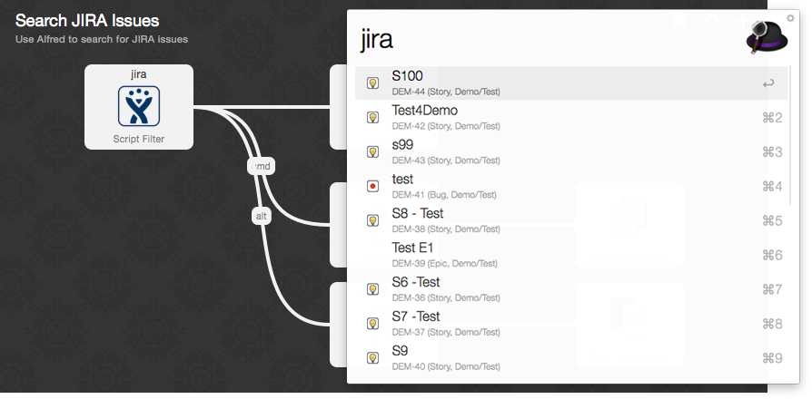

# Search Jira Issues - Alfred 2 Workflow



This workflow for Alfred 2 allows you to search issues on an Atlassian Jira installation. The queries used are customizable to your needs.

## Dependencies

* `jsawk`
* `curl`

The easiest way to install the dependencies is [`brew`](http://brew.sh/):

```bash
$ brew install curl jsawk
```

## Installation
Download the [latest release](https://github.com/swissmanu/search-jira-issues-alfred-workflow/releases/latest) and open the `search.jira-issues.alfredworkflow` file to install it automatically to Alfred.

## Configuration
You have to create your own `config.json` file before you can use the new workflow:

1. Open your Alfred settings, select the `Workflows` tab
2. Right click the `Search JIRA Issues` workflow and select `Show in Finder`
3. Copy the `config.sample.json` file and rename it to `config.json`. Open the copied file in the text editor of your choice.
4. Modify the contained settings to your needs. Look below for further explanation of each setting.
5. Save `config.json` and you are ready to go.


### Available Settings

| Setting | Description | Example |
| ------- | ----------- | ------- |
| `user`  | The username you use to login to JIRA. | `spongebob` |
| `password` | The password associated to the given username to login to JIRA. | `supersecret` |
| `jiraUrl` | The URL of your JIRA installation. Make sure you DON'T enter a trailing `/`. | `https://myjira.com` |
| `maxResults` | Limit the number of issues to display. | `20` |
| `emptySearchJql` | This JQL query is executed if you don't enter any search term after the workflows keyword. See [Atlassians JQL documentation](https://confluence.atlassian.com/display/JIRA/Advanced+Searching) for available query options. | `project = 'FOO' ORDER BY lastViewed` |
| `searchJql` | This JQL query is executed if you enter a search term after the workflows keyword. Use `{query}` to pass the entered search term to JIRA's API. See [Atlassians JQL documentation](https://confluence.atlassian.com/display/JIRA/Advanced+Searching) for available query options. | `project = 'FOO' summary~'{query}' ORDER BY lastViewed` |

## Usage
Open your Alfred prompt and start typing `jira`. The workflow will call JIRA's API with the given `emptySearchJql` JQL query if you enter no specific search term.
As soon as you begin to type further, the `searchJql` JQL is used to fetch any matching issues.

* Select an issue to open it in your default browser
* Press `cmd` and select an issue copies the issues number to your clipboard
* Press `alt` and select an issue copy-pastes the issues number to the current application.


## Troubleshooting
If Alfred is not able to retrieve any issues following fixes might help you:

* Ensure that the `Script Filter` and all `Run Script` actions use your main shell as interpreter
* Check your `config.json` for invalid JSON and/or wrong values


# License
Copyright (c) 2015 Manuel Alabor

Permission is hereby granted, free of charge, to any person obtaining a copy of this software and associated documentation files (the "Software"), to deal in the Software without restriction, including without limitation the rights to use, copy, modify, merge, publish, distribute, sublicense, and/or sell copies of the Software, and to permit persons to whom the Software is furnished to do so, subject to the following conditions:

The above copyright notice and this permission notice shall be included in all copies or substantial portions of the Software.

THE SOFTWARE IS PROVIDED "AS IS", WITHOUT WARRANTY OF ANY KIND, EXPRESS OR IMPLIED, INCLUDING BUT NOT LIMITED TO THE WARRANTIES OF MERCHANTABILITY, FITNESS FOR A PARTICULAR PURPOSE AND NONINFRINGEMENT. IN NO EVENT SHALL THE AUTHORS OR COPYRIGHT HOLDERS BE LIABLE FOR ANY CLAIM, DAMAGES OR OTHER LIABILITY, WHETHER IN AN ACTION OF CONTRACT, TORT OR OTHERWISE, ARISING FROM, OUT OF OR IN CONNECTION WITH THE SOFTWARE OR THE USE OR OTHER DEALINGS IN THE SOFTWARE.

